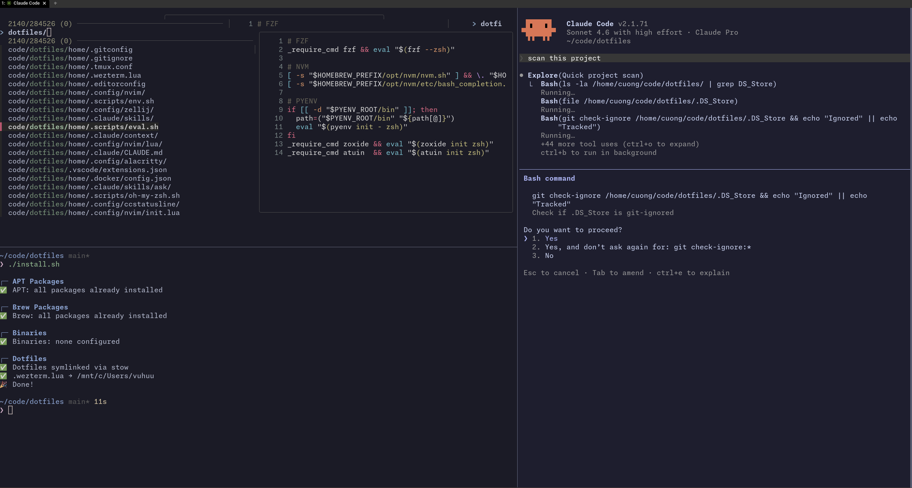

# Dotfiles

Personal dotfiles for macOS, Linux, and WSL (Windows Subsystem for Linux).



## What's Included

| File/Dir | Description |
|---|---|
| `.zshrc` | Zsh entry point — loads env, plugins, prompt, and keybindings |
| `.zsh_plugins.txt` | Plugin list managed by [antidote](https://github.com/mattmc3/antidote) |
| `.p10k.zsh` | [Powerlevel10k](https://github.com/romkatv/powerlevel10k) prompt config |
| `.tmux.conf` | Tmux terminal multiplexer settings |
| `.wezterm.lua` | WezTerm terminal emulator config (Catppuccin Mocha, Nerd Font, pane/tab keybindings) |
| `.gitconfig` | Git config with aliases and settings |
| `.gitignore` | Global gitignore |
| `.editorconfig` | Consistent coding style across editors |
| `.config/nvim/` | Neovim config (`init.lua` + plugins) |
| `.config/zellij/` | Zellij terminal multiplexer config with Catppuccin theme |
| `.config/alacritty/` | Alacritty terminal emulator config |
| `.scripts/` | Helper scripts sourced by `.zshrc` (env, evals, keybindings) |
| `.docker/config.json` | Docker CLI config |

### Zsh plugins (via antidote)

- `zsh-syntax-highlighting` — real-time command syntax coloring
- `zsh-autosuggestions` — fish-like inline suggestions
- `zsh-completions` — extended completion definitions
- oh-my-zsh plugins: `git`, `fzf`, `docker`, `docker-compose`, `nvm`, `yarn`, `vi-mode`, `sudo`, `tmux`, and more

### Tools initialized in shell

| Tool | Purpose |
|---|---|
| [fzf](https://github.com/junegunn/fzf) | Fuzzy finder |
| [zoxide](https://github.com/ajeetdsouza/zoxide) | Smarter `cd` |
| [atuin](https://github.com/atuinsh/atuin) | Shell history sync & search |
| [nvm](https://github.com/nvm-sh/nvm) | Node version manager |
| [pyenv](https://github.com/pyenv/pyenv) | Python version manager |

---

## Prerequisites

Install these **before** running `install.sh`.

### 1. Zsh

```bash
# Ubuntu/Debian
sudo apt install zsh
chsh -s $(which zsh)
```

Verify: `echo $SHELL` should output `/usr/bin/zsh` (re-login if needed).

### 2. Homebrew

```bash
/bin/bash -c "$(curl -fsSL https://raw.githubusercontent.com/Homebrew/install/HEAD/install.sh)"
```

Works on both Linux and macOS. See [brew.sh](https://brew.sh) for details.

### 3. Nerd Font

The WezTerm config uses **MonaspiceNe Nerd Font Mono** (`MonaspiceNe Nerd Font Mono` on Linux, `MonaspiceNeNFM` on Windows).

Download from [nerdfonts.com](https://www.nerdfonts.com/font-downloads) or via the Nerd Fonts GitHub releases. Install the font and set it in your terminal emulator.

### 4. WezTerm (optional — Windows/WSL users)

Download from [wezfurlong.org/wezterm](https://wezfurlong.org/wezterm/installation.html).

The install script automatically copies `.wezterm.lua` to your Windows user profile (`%USERPROFILE%`) when running inside WSL.

---

## Installation

```bash
git clone https://github.com/your-username/dotfiles.git ~/code/dotfiles
cd ~/code/dotfiles
./install.sh
```

The script will:

1. Verify you are running Zsh
2. Install oh-my-zsh if not present
3. Check Homebrew is available
4. Copy all dotfiles from `home/` to `$HOME` (via `rsync`)
5. Copy `.wezterm.lua` to the Windows profile (WSL only)
6. Install APT packages (Linux only)
7. Install Homebrew packages
8. Install standalone binaries to `~/.local/bin`
9. Reload `.zshrc`

### Packages installed automatically

**APT (Linux only)**

`curl` `htop` `iperf3` `lsof` `rsync` `vim` `wget` `progress` `gcc`

**Homebrew — Linux**

`fzf` `zoxide` `antidote` `nvm` `pyenv` `yarn` `atuin` `neovim` `delta` `eza` `zellij` `rust` `docker` `docker-compose` `shfmt` `pnpm`

**Homebrew — macOS**

`fzf` `zoxide` `antidote` `nvm` `pyenv` `yarn` `atuin` `neovim` `delta` `rust` `docker` `docker-compose` `iperf3` `shfmt` `pnpm`

> Already-installed packages are skipped automatically — safe to re-run.

