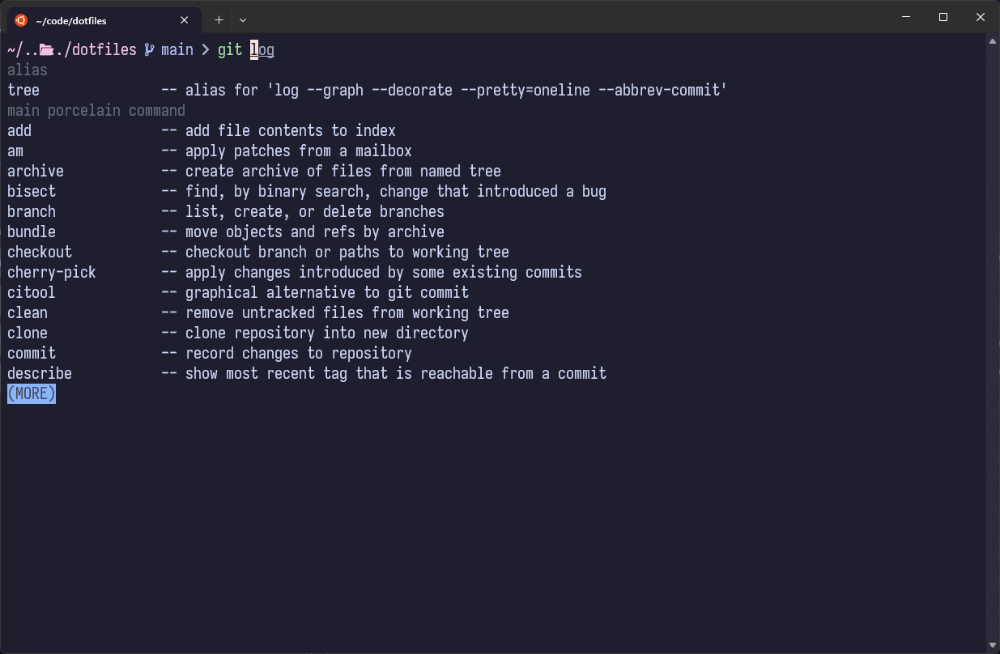

# Dotfiles

## Overview
🌟 A collection of my personal dotfiles



## What's Included

- `.zshrc` - Zsh shell configuration with custom aliases and functions
- `.p10k.zsh` - Powerlevel10k (zsh theme) configuration
- `.tmux.conf` - Tmux terminal multiplexer settings
- `.gitconfig` - Git configuration with aliases and settings
- `.gitignore` - Global gitignore file
- `.editorconfig` - Editor configuration for consistent coding styles

## Prerequisites
Make sure you install these first:
- [Brew](https://brew.sh/) for both Linux & MacOS
- [Zsh shell + oh-my-zsh](https://github.com/ohmyzsh/ohmyzsh)
- [Nerd Fonts](https://www.nerdfonts.com/) (required to display icons)

## Installation
Run

```bash
./install.sh
```

The script will copy all necessary files into your $HOME directory
